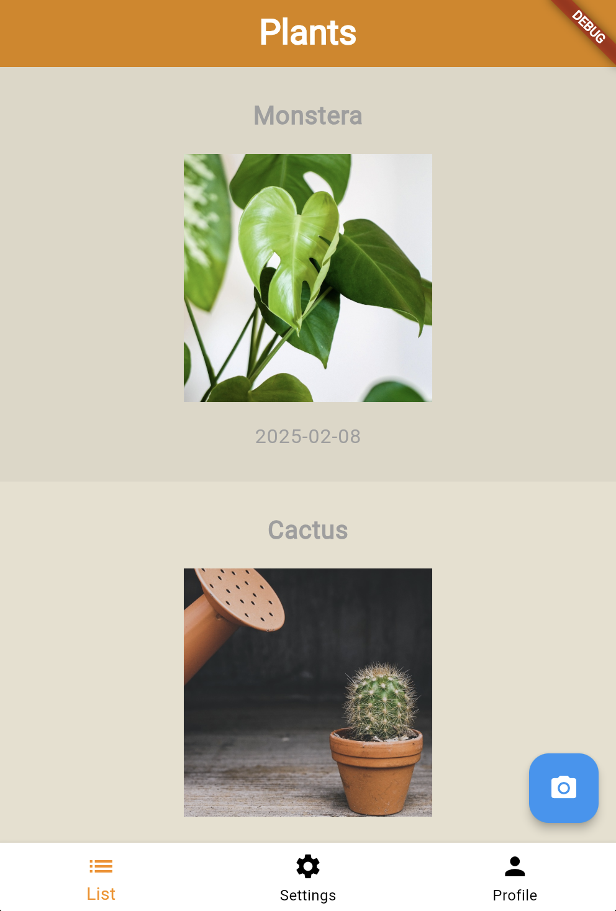
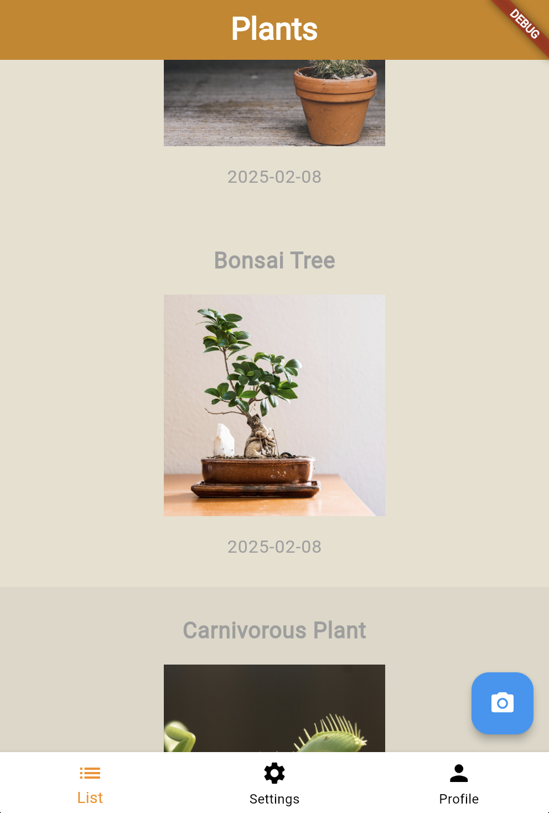
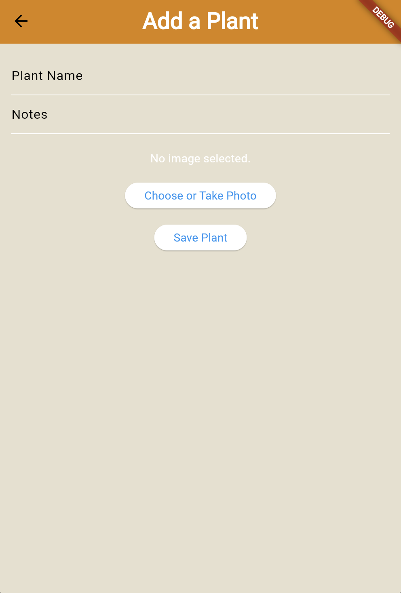
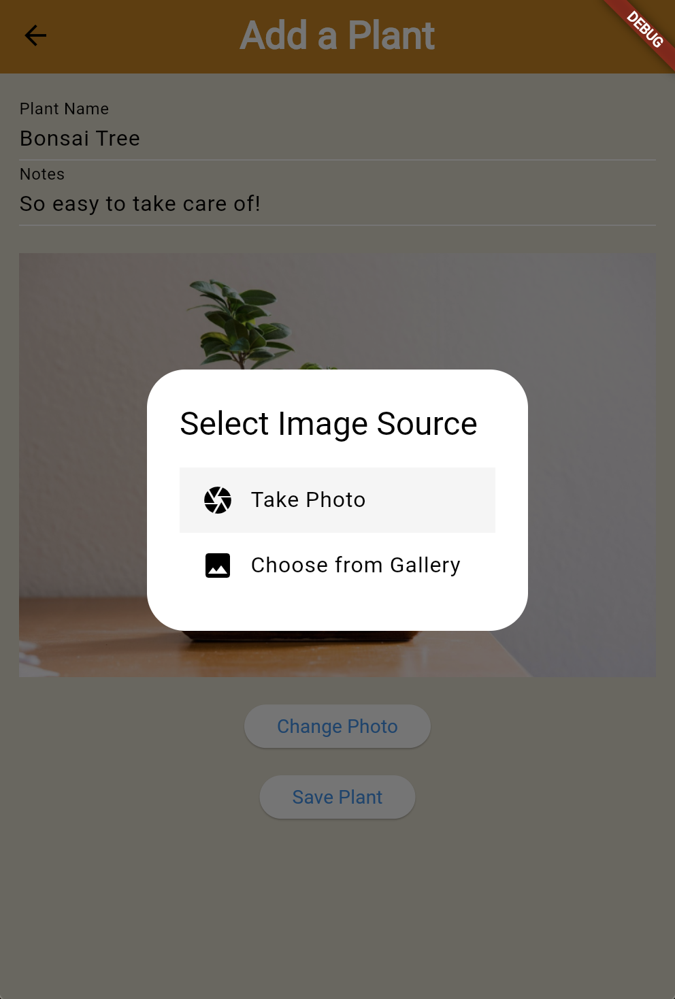
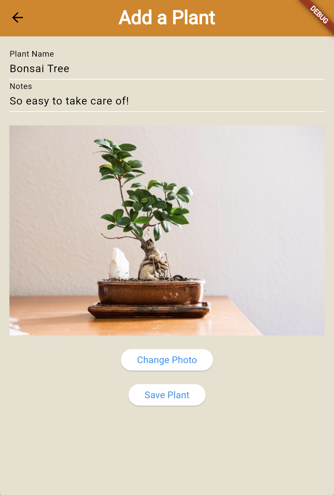
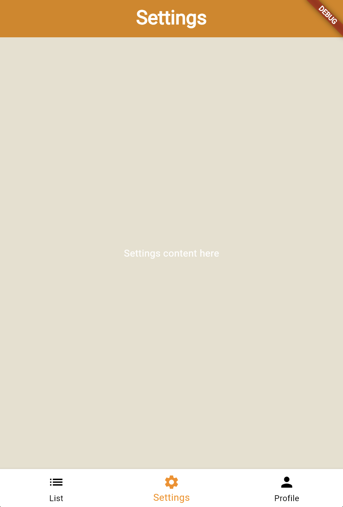
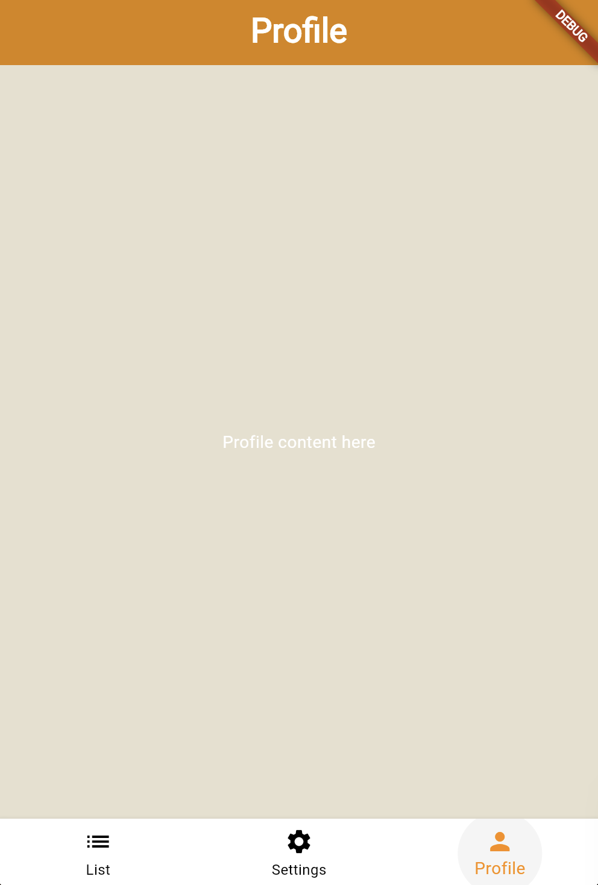

# Plant Photo App

## Description
The **Plant Photo App** is a simple mobile application developed to help users manage and catalog their plants. The app allows users to add plant details such as their name, photo, and notes. Users can capture plant photos directly from the camera or select images from their gallery. It also allows users to view and manage their plants in a list view.

   

  

 

## Technologies Used

- **Flutter**: A popular framework for building cross-platform mobile apps.
- **Provider**: For state management, providing a simple and scalable solution for managing plant data across the app.
- **Image Picker**: To enable users to pick images from the camera or gallery.
- **Intl**: For formatting dates in a user-friendly way.
- **Dart**: The programming language used for building the app.
- **Material Design**: For creating a clean and modern UI.

## Features

- Add plants with a name, photo, and optional notes.
- View a list of added plants with their photos and dates.
- Choose images from the camera or gallery.
- Responsive design supporting both mobile and web platforms.
- Uses `Provider` for simple state management to handle the list of plants.

## Architecture and Technical Decisions

### State Management
- **Provider**: The app uses **Provider** for state management. It provides an efficient way to handle the app’s plant data, ensuring the UI reacts to changes in the state.
  
### Data Storage
- The app uses **temporary storage** for plant data. The data is not stored persistently, meaning it will reset when the app restarts. You could later integrate a local database like SQLite or shared preferences for persistent storage if needed.

### User Interface
- The app uses **Material Design** for the UI, offering a simple and intuitive interface for interacting with the plant data.

### Platform
- The app is built using **Flutter**, allowing it to run on both Android and iOS platforms, as well as the web.

## Installation and Setup

To run the app locally, follow these steps:

### Prerequisites

Make sure you have the following installed:
- **Flutter SDK**: [Flutter installation guide](https://flutter.dev/docs/get-started/install)
- **Android Studio** or **VS Code** with Flutter plugin (optional, but recommended for development)
- **Xcode** and **CocoaPods** (for iOS development on macOS)

### Step-by-Step Guide

1. Clone the repository:
   ```bash
   git clone https://github.com/nehannin/plant-photo-app.git

2. Navigate to the project directory:
    ```bash
    cd plant-photo-app

3. Install dependecies:
    ```bash
    flutter pub get

4. Run the app on your emulator or physical device:
    ```bash
    flutter run

The app should now launch on your device or simulator. You can start adding plants, viewing the list, and taking photos!

### Folder Structure

    lib/
    │
    ├── models/
    │   └── plant.dart       # Model for the Plant data
    │
    ├── providers/
    │   └── plant_provider.dart  # Provider for managing plant data
    │
    ├── screens/
    │   ├── home_screen.dart  # Main screen with bottom navigation
    │   ├── list_view.dart    # List of all plants
    │   ├── profile_screen.dart  # Profile screen (placeholder for future content)
    │   ├── scan_view.dart    # Screen for adding new plants (image capture)
    │
    └── main.dart            # Main entry point for the app

## Future Improvements

- Implement persistent data storage (e.g., SQLite or Firebase)
- Add search and filtering functionality for plant list
- Enable notifications or reminders for plant care